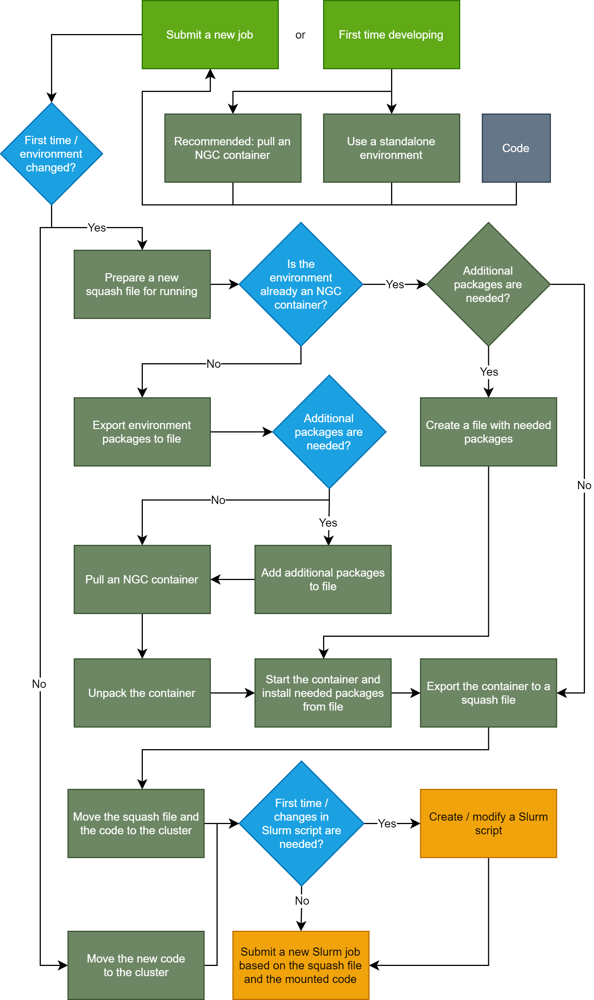

# Pre-Slurm Tutorial

## Introduction

Best practices for preparing your environment to run as a Slurm job. Procedure includes pulling, modifying and converting a container from [NGC](https://catalog.ngc.nvidia.com/) using [NVIDIA Enroot](https://github.com/NVIDIA/enroot). A multi-node [Horovod](https://github.com/horovod/horovod) example is included.

We strongly recommend to work with a container as your neutral environment and mount your code from outside the container.

A flowchart of the process:

[](flowchart.png)

## Pre-requirements

Install [NVIDIA Enroot](https://github.com/NVIDIA/enroot/blob/master/doc/installation.md) in your workspace, if not yet installed.

## Episode 1 - Development

Our recommendation is to start developing based on an optimized container from [NGC](https://catalog.ngc.nvidia.com/). Chances are the required packages are installed and no modification is needed. If this is not the case, you can modify the container to fit your requirements.

### Case A - Fresh start

1. Pull a relevant container from NGC using NVIDIA Enroot.

    Optimized frameworks ([PyTorch](https://catalog.ngc.nvidia.com/orgs/nvidia/containers/pytorch), [TensorFlow](https://catalog.ngc.nvidia.com/orgs/nvidia/containers/tensorflow), etc.) containers are available and updated monthly. To find which container fits your desired environment visit our [Optimized Framework Release Notes](https://docs.nvidia.com/deeplearning/frameworks/#optimized-frameworks-release-notes) and search for the relevant container release.

    Pull command:

    ```bash
    enroot import 'docker://nvcr.io#nvidia/<framework>:<tag>'
    ```

    E.g., to pull a 22.01 release TensorFlow container run:

    ```bash
    enroot import 'docker://nvcr.io#nvidia/tensorflow:22.01-tf1-py3'
    ```

    A container will be pulled and converted to a local [squash](https://en.wikipedia.org/wiki/SquashFS) file.

2. Export the container to Enroot's data path.

    ```bash
    enroot create --name <environment_name> <squash_file>
    ```

    E.g., to export the TensorFlow container run:

    ```bash
    enroot create --name nvidia_tf nvidia+tensorflow+22.01-tf1-py3.sqsh
    ```

    To view all exported containers run:

    ```bash
    enroot list
    ```

3. Start and work on the container.

    ```bash
    enroot start --root --rw --mount <local_folder>:<container_folder> <environment_name>
    ```

    - `--root` enables root privileges.
    - `--rw` enables read and write permissions (any changes inside the container will be saved).
    - `--mount` enables mounting of a local folder (to mount your code and data).

    More configurations are available in Enroot's [start](https://github.com/NVIDIA/enroot/blob/master/doc/cmd/start.md) command documentations.

    To exit the container run `exit`.

### Case B - Existing Docker container

To convert an existing (local) container from Docker registry, as explained [here](https://github.com/NVIDIA/enroot/blob/master/doc/cmd/import.md), run:

```bash
docker import 'dockerd://<image>:<tag>'
```

The container will be converted to a local squash file. Continue from [Case A2](#case-a---fresh-start).

### Case C - Existing non-containerized environment

1. Identify your current framework version.

    ```bash
    <pip|conda> list | grep <framework>
    ```

    E.g., to identify which TensorFlow version you are using on pip environment, run:

    ```bash
    pip list | grep torch
    ```

2. Pull the relevant framework container from NGC.

    Follow [Case A](#case-a---fresh-start) steps.

3. Modify the container with the relevant packages.

    We recommend to upgrade, install and change only necessary packages. Therefore, the best practice is to first try and run your code on the original container and to install packages as needed.

    One way to mimic your environment is to export all packages to a file and use this file to install them inside the container.

    - For pip environment run `pip freeze > requirements.txt`.
    - For conda environment run `conda env export > environment.yml`, as suggested [here](https://docs.conda.io/projects/conda/en/latest/user-guide/tasks/manage-environments.html#sharing-an-environment).

    __Note:__ remove all lines containing the relevant framework (E.g., TensorFlow). It is recommended not to override the container default framework.

    Then, start your container, mount this file, and install the relevant packages.

## Episode 2 - Exporting your environment to a squash file

Slurm uses squash files to run jobs. Therefore, your environment should be exported to a (new) squash file, containing all the changes you performed (if any).

1. Export your current environment to a squash file.

    ```bash
    enroot export --output <squash_file> <environment_name>
    ```

    A new squash file will be locally created.

    __Note:__ move the squash file to a location accessible to Slurm.

2. __Optional:__ remove old squash files and clear Enroot's data path.

    The original, unmodified squash file can be deleted. Additionally, to delete the exported container under Enroot's data path run:

    ```bash
    enroot remove <environment_name>
    ```

## Episode 3 - Submitting a Slurm job

Slurm jobs can be submitted either via a `srun` or a `sbatch` commands. To submit a job from the "login" node use `sbatch` and prepare a designated script.

### Case A - MPI

Relevant for executing multi-GPU / multi-node runs using MPI. We'll use Horovod's example for that.

__Note:__ also relevant for single-GPU runs, but MPI is redundant.

1. Clone Horovod's repository.

    ```bash
    git clone https://github.com/horovod/horovod
    ```

2. Create a Slurm script file.

    Create a new file, paste the following code and save:

    ```bash
    #!/bin/bash
    #SBATCH --job-name horovod_tf
    #SBATCH --output %x-%j.out
    #SBATCH --error %x-%j.err
    #SBATCH --ntasks 1
    #SBATCH --cpus-per-task 32
    #SBATCH --gpus-per-task 16

    srun --container-image $1 \
    --container-mounts $2:/code \
    --no-container-entrypoint \
    /bin/bash -c \
    "python /code/horovod/examples/tensorflow/tensorflow_synthetic_benchmark.py \
    --batch-size 256"
    ```

    - `%x` - Job name.
    - `%j` - Job ID.

    __Note:__ this script is intended to run on 16 GPUs, modify it if needed. Notice how only a single task (`--ntasks 1`) is needed for running with MPI.

3. Submit a new Slurm job.

    ```bash
    sbatch <script_file> <squash_file> <horovods_git_folder>
    ```

    Two files will be locally created, one for the output and one for the errors.

### Case B - OpenMP

Relevant for executing single-GPU / multi-GPU runs in a single / multi-threaded manner with the framework's native support.

Create a Slurm script identical to [Case A](#case-a---mpi), and change the following lines:

```bash
#SBATCH --ntasks <number of GPUs>
#SBATCH --cpus-per-task 32
#SBATCH --gpus-per-task 1
```

This will create a separate task per GPU.
